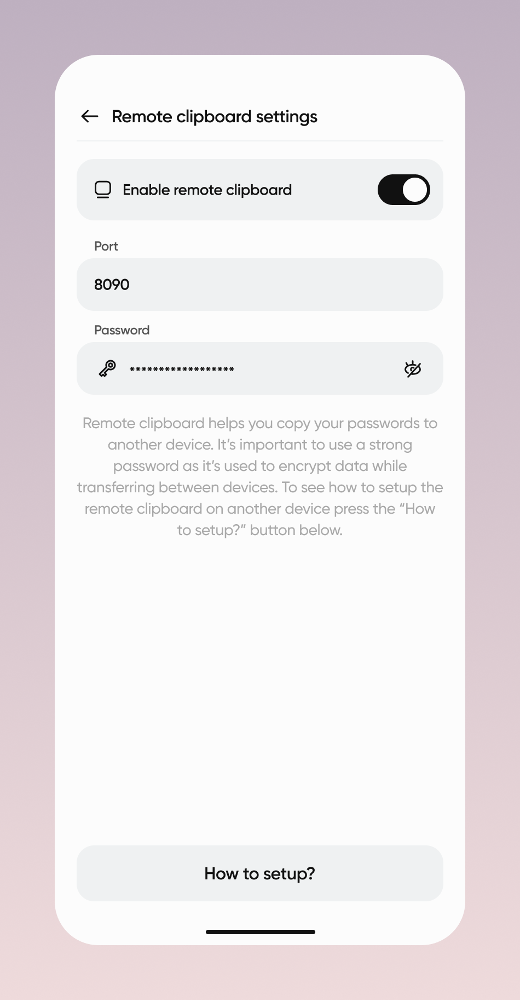

[Українська](https://github.com/astsu-dev/vaulty-remote-clipboard/blob/main/README_UA.md)

# Vaulty Remote Clipboard - copy your passwords from the Vaulty mobile app to your computer

The main philosophy of the [Vaulty](https://github.com/astsu-dev/vaulty-mobile) mobile application is to store your passwords only on your smartphone from the security purposes.
This is why the application does not have a web version or a desktop version.
However, sometimes you need to copy your password from the Vaulty to your computer.
This is where the Vaulty Remote Clipboard application comes in handy.
It allows you to securely copy your passwords from the Vaulty mobile application to your computer using the local Wi-Fi network.

    
    

## Installation

Download the latest version of the application from the [Releases](https://github.com/astsu-dev/vaulty-remote-clipboard/releases/latest) page.

## How to use the application?

1. Make sure that your devices are connected to the same local network.
2. Open the Vaulty Remote Clipboard application.
3. Enter the password. Use the strong password to prevent the data interception by other devices in the local network.
4. Click the "Start" button to run the server.
If all is well, you will see the log message indicates the server is running below the start button.
The password field will be empty after the server is started for security purposes.
5. Open the Vaulty mobile application.
6. Go to "Settings" -> "Remote clipboard".
7. Enable the "Remote clipboard" feature.
8. Enter the same password as in the desktop application.
If you change the port in the desktop application from the default `8090` value,
you should also change it in the mobile application.
9. Now the remote clipboard feature is set up and you can try to copy the password to your computer.
For this, press the "Copy to remote" button (computer icon) near the password you want to copy.
You'll see the message in the mobile app that the password was copied to the computer.
Try to paste the password somewhere on your computer to check if it was copied successfully.
If the password was not copied, probably you entered not the same password on both devices.
10. You can close the desktop application and it will be minimized to the system tray.

> **Note:** The passwords will not be copied if your devices are not connected to the same local network.

> **Note:** As the application uses the UDP protocol which can lose packets, sometimes you need to copy the password twice as the first datagram can be lost.

## How it works?

The application starts the UDP server on the specified port.
The entered password is used to encrypt and decrypt the data between the mobile application and the server using AES-256 GCM encryption algorithm.
This is why you need to enter the same password on both devices.
The mobile application sends the encrypted UDP datagram with the desired data to copy to the server when you press the "Copy to remote" button (computer icon) in your mobile app.
It is not needed for the mobile application to know the exact IP address of the server as it uses the broadcast address of the local network.
It means that you must be connected to the same local network to use the remote clipboard feature.
As the broadcast address is used, the encrypted datagram is sent to all devices in the local network.
However only devices with the same encryption password can decrypt the datagram.
You should use the strong password to prevent the data interception by other devices in the local network.
After the server receives the datagram, it decrypts it and set the decrypted data to the system clipboard.

## Build

To build the application yourself go to the [BUILD](https://github.com/astsu-dev/vaulty-remote-clipboard/blob/main/BUILD.md) page.
