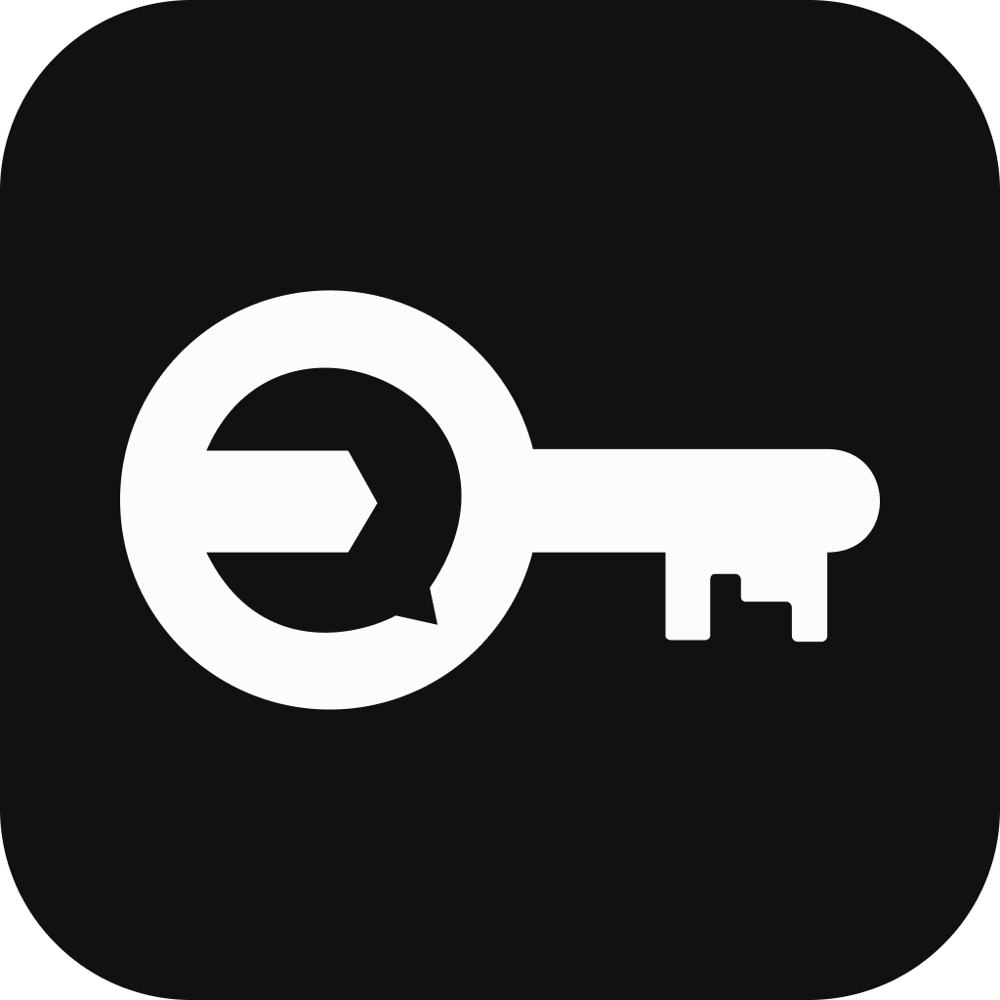
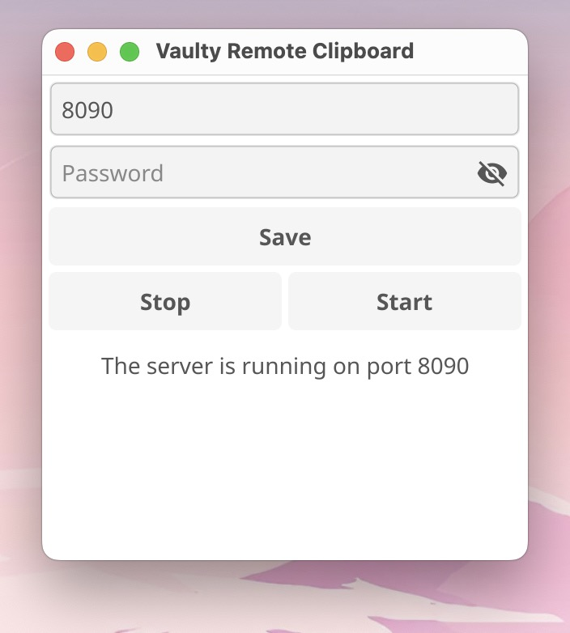

[English](https://github.com/astsu-dev/vaulty-remote-clipboard)

# Vaulty Remote Clipboard - копіюйте свої паролі з мобільного додатку Vaulty на комп'ютер

Основна філософія мобільного додатку [Vaulty](https://github.com/astsu-dev/vaulty-mobile) полягає в тому,
щоб зберігати ваші паролі виключно на смартфоні з міркувань безпеки.
Саме тому додаток не має веб-версії чи версії для настільного комп'ютера.
Однак іноді вам потрібно скопіювати пароль з Vaulty на комп'ютер.
Тут стає в нагоді додаток Vaulty Remote Clipboard.
Він дозволяє безпечно копіювати паролі з мобільного додатку Vaulty на ваш комп'ютер за допомогою локальної Wi-Fi мережі.

    
    

## Встановлення

Завантажте останню версію додатку для вашої операційної системи зі сторінки [Releases](https://github.com/astsu-dev/vaulty-remote-clipboard/releases/latest).

## Як використовувати додаток?

1. Переконайтесь, що ваші пристрої підключені до однієї локальної мережі.
2. Відкрийте додаток Vaulty Remote Clipboard.
3. Введіть пароль. Використовуйте надійний пароль, щоб запобігти перехопленню даних іншими пристроями у локальній мережі.
4. Натисніть кнопку "Start", щоб запустити сервер.
Якщо все добре, ви побачите повідомлення під кнопкою запуску, яке свідчить про запуск сервера.
Поле для введення пароля буде очищене після запуску сервера з міркувань безпеки.
5. Відкрийте мобільний додаток Vaulty.
6. Перейдіть до "Налаштування" -> "Віддалений буфер обміну".
7. Увімкніть функцію "Віддалений буфер обміну".
8. Введіть той самий пароль, що і в настільному додатку.
Якщо ви змінили порт у настільному додатку зі значення за замовчуванням `8090`,
його також потрібно змінити в мобільному додатку.
9. Тепер функцію віддаленого буфера обміну налаштовано, і ви можете спробувати скопіювати пароль на комп'ютер.
Для цього натисніть кнопку "Скопіювати на віддалений пристрій" (значок комп'ютера) біля пароля,
який ви хочете скопіювати. Ви побачите повідомлення в мобільному додатку, що пароль був скопійований на комп'ютер.
Спробуйте вставити пароль десь на своєму комп'ютері, щоб перевірити, чи його було успішно скопійовано.
Якщо пароль не скопійовано, ймовірно, ви ввели різні паролі на обох пристроях.
10. Ви можете закрити настільний додаток, і він буде згорнутий у системний трей.

> **Note:** Паролі не будуть копіюватися, якщо ваші пристрої не підключені до однієї локальної мережі.

> **Note:** Оскільки додаток використовує протокол UDP, який допускає втрату пакетів при передачі, іноді вам потрібно скопіювати пароль двічі, оскільки першу UDP-датаграму може бути втрачено.

## Як це працює?

Додаток запускає UDP-сервер на зазначеному порту.
Введений пароль використовується для шифрування та дешифрування даних між мобільним додатком
і сервером за допомогою алгоритму шифрування AES-256 GCM.
Саме тому вам потрібно вводити той самий пароль на обох пристроях.
Мобільний додаток відправляє зашифровану UDP-датаграму з необхідними даними для копіювання на сервер,
коли ви натискаєте кнопку "Скопіювати на віддалений пристрій" (значок комп'ютера) у мобільному додатку.
Для цього мобільному додатку не потрібно знати точну IP-адресу сервера,
оскільки використовується широкомовна адреса локальної мережі.
Це означає, що ви повинні бути підключені до однієї локальної мережі на обох пристроях,
щоб використовувати функцію віддаленого буфера обміну.
Оскільки використовується широкомовна адреса, зашифрована датаграма надсилається всім пристроям у локальній мережі.
Однак лише пристрої з однаковим паролем шифрування можуть дешифрувати цю датаграму.
Вам слід використовувати надійний пароль, щоб запобігти перехопленню даних іншими пристроями у локальній мережі.
Після того, як сервер отримує датаграму, він дешифрує її та копіює розшифровані дані у системний буфер обміну.

## Збірка

Щоб зібрати додаток самостійно, перейдіть на сторінку [BUILD](https://github.com/astsu-dev/vaulty-remote-clipboard/blob/main/BUILD.md).
